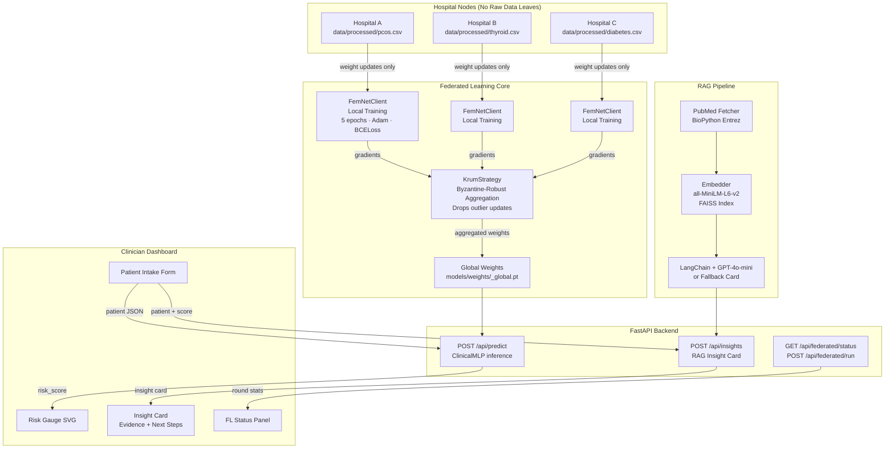
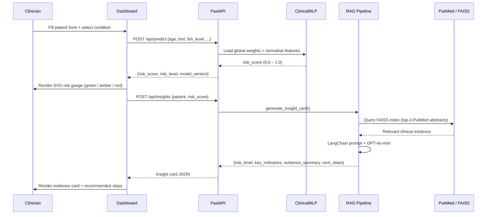
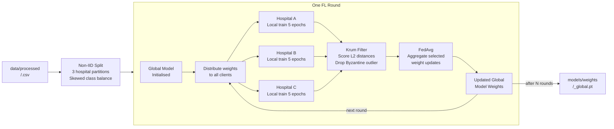
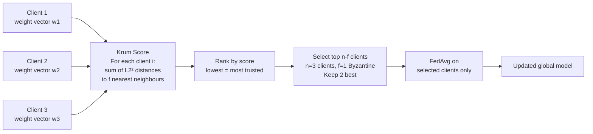

<div align="center">

# FEM-NET
### Federated Early Misdiagnosis Network

**Privacy-preserving AI for early detection of underdiagnosed women's health conditions**

[](https://python.org)
[](https://pytorch.org)
[](https://flower.ai)
[](https://fastapi.tiangolo.com)
[](https://langchain.com)
[](LICENSE)

> Raw patient data **never leaves the hospital**. Only model weight updates travel across nodes.

</div>

---

# Submission Demo (Windows)

1. Install

```bash
pip install -r requirements.txt
```

2. Run

```bash
python run.py serve
```

3. Open

http://localhost:8000

4. Federated demo

- Click “Run Federated”
- Wait ~30 seconds
- Click refresh to see rounds/AUC update

Notes:
- Insights work even without an OpenAI key (automatic fallback mode)
- Use Python 3.10 or 3.11 (recommended). Python 3.13 will not work with the current Flower/NumPy requirements.

## What is FEM-NET?

FEM-NET is a federated learning platform where multiple hospitals collaboratively train early-detection AI models for women's health — without sharing a single row of patient data. Each hospital trains locally; only compressed weight updates flow to a central aggregator that uses **Byzantine-robust Krum filtering** to resist poisoned updates.

A clinician enters patient vitals into the dashboard, receives a real-time risk score from the global model, and gets an evidence-backed insight card sourced from live PubMed literature.

---

## Conditions Detected

| Condition | Source Dataset | Rows | Target AUC |
|---|---|---|---|
| PCOS | Kaggle — Prasoon Kottarathil + Shreyas Vedpathak | ~541 | > 0.80 |
| Breast Cancer | UCI Wisconsin Diagnostic | 569 | > 0.95 |
| Cervical Cancer | Ranzeet013 Risk Factors | 858 | > 0.78 |
| Thyroid Disorder | Yasser Hessein | 9,172 | > 0.85 |
| Diabetes | Pima Indians (UCI) | 768 | > 0.82 |
| Cardiovascular Disease | Sulianova | 70,000 | > 0.79 |
| Heart Disease | UCI Cleveland + multi-source | 920 | > 0.88 |

---

## System Architecture



---

## Data Flow



---

## Federated Learning Flow



---

## Project Structure

```
fem-net/
├── api/
│   ├── main.py                  FastAPI app, lifespan, CORS, static mount
│   ├── schemas.py               Pydantic models (PatientInput, InsightCard, ...)
│   └── routes/
│       ├── predict.py           POST /api/predict
│       ├── insights.py          POST /api/insights
│       └── federated.py         GET/POST federated status + trigger
│
├── federated/
│   ├── strategy.py              KrumStrategy — Byzantine-robust aggregation
│   ├── client.py                FemNetClient — Flower NumPyClient
│   └── server.py                Flower server launcher
│
├── models/
│   ├── base_model.py            ClinicalMLP (10→128→64→32→1, BatchNorm, Dropout)
│   ├── condition_models.py      get_model() factory, save_model()
│   └── weights/                 *.pt + *_norm_stats.json (gitignored, trained locally)
│
├── rag/
│   ├── pubmed_fetcher.py        BioPython Entrez + 24h cache
│   ├── embedder.py              SentenceTransformer + FAISS flat index
│   └── insight_generator.py    LangChain RAG → clinical insight card
│
├── simulation/
│   └── run_simulation.py        In-process FL sim, non-IID splits, saves global weights
│
├── data/
│   ├── preprocess_<condition>.py    Per-condition preprocessing (Suraj / Kuber)
│   └── processed/                   Standardised 10-feature CSVs (gitignored)
│
├── training/
│   └── train_model.py           Unified trainer — outputs .pt + norm_stats.json
│
└── dashboard/
    ├── index.html               Clinician UI
    └── static/
        ├── style.css
        └── app.js
```

---

## Quickstart

### 1. Install dependencies

```bash
pip install -r requirements.txt
```

### 2. Configure environment

```bash
cp .env.example .env
# Edit .env:
# ENTREZ_EMAIL=your@email.com
# OPENAI_API_KEY=sk-...   (optional — RAG falls back gracefully without it)
```

### 3. Add processed datasets

Teammates Suraj and Kuber run preprocessing scripts. Once `data/processed/` has CSVs:

```bash
ls data/processed/
# pcos.csv  breast_cancer.csv  cervical.csv
# thyroid.csv  diabetes.csv  cardiovascular.csv  heart.csv
```

### 4. Train models

```bash
python training/train_model.py --condition pcos --epochs 50
python training/train_model.py --condition thyroid --epochs 50
# ... repeat for each condition
```

### 5. Run federated simulation

```bash
python -m simulation.run_simulation --condition pcos --rounds 5
```

```
[FEM-NET] Starting FL simulation: condition=pcos, rounds=5
[Krum] round 1: kept 2/3 clients (dropped 1 outlier)
[Krum] round 2: kept 2/3 clients (dropped 1 outlier)
...
=== Simulation complete: pcos ===
  Rounds : 5
  Last AUC: 0.8341
  Results → simulation/results_pcos.json
```

### 6. Start the API

```bash
uvicorn api.main:app --reload
```

Open `http://localhost:8000` — fill the clinician form, see the risk gauge and insight card.

---

## API Reference

### `POST /api/predict`

```json
{
  "age": 28,
  "bmi": 24.5,
  "fsh_level": 7.2,
  "lh_level": 12.4,
  "amh_level": 3.1,
  "tsh_level": 2.5,
  "cycle_length_days": 30,
  "follicle_count": 10,
  "fatigue_score": 5,
  "weight_gain_kg": 3.0,
  "condition": "pcos"
}
```

Response:
```json
{
  "risk_score": 0.7821,
  "risk_level": "High",
  "model_version": "pcos-v1715234400"
}
```

### `POST /api/insights`

Request: same patient fields + `"risk_score": 0.78`

Response:
```json
{
  "risk_level": "High",
  "key_indicators": ["LH: 12.40 (elevated)", "AMH: 3.10", "..."],
  "evidence_summary": "Based on retrieved literature: ...",
  "recommended_next_steps": ["Consult specialist", "Hormone panel", "..."]
}
```

### `GET /api/federated/status?condition=pcos`

```json
{
  "condition": "pcos",
  "num_rounds_completed": 5,
  "participating_hospitals": 3,
  "last_global_auc": 0.8341
}
```

### `POST /api/federated/run?condition=pcos&rounds=5`

Triggers background FL simulation. Returns immediately:
```json
{ "status": "started", "condition": "pcos", "rounds": 5 }
```

---

## Model Architecture

```
Input (10 features)
       │
  Linear(10 → 128)
  BatchNorm1d(128)
  ReLU
  Dropout(0.3)
       │
  Linear(128 → 64)
  BatchNorm1d(64)
  ReLU
  Dropout(0.3)
       │
  Linear(64 → 32)
  ReLU
       │
  Linear(32 → 1)
  Sigmoid
       │
  risk_score ∈ [0, 1]
```

**10 input features** (standardised per condition):
`age · bmi · fsh_level · lh_level · amh_level · tsh_level · cycle_length_days · follicle_count · fatigue_score · weight_gain_kg`

---

## Byzantine-Robust Aggregation (Krum)

Standard federated averaging is vulnerable to poisoned clients. FEM-NET uses **Multi-Krum** to filter outliers before aggregation:



---

## Team

| Member | Role | Owns |
|---|---|---|
| **Kruthi** | ML Lead | FL engine, API, RAG pipeline, dashboard, models |
| **Suraj** | ML Engineer | PCOS, Breast Cancer, Cervical Cancer preprocessing + training |
| **Kuber** | ML Engineer | Thyroid, Diabetes, Cardiovascular, Heart preprocessing + training |
| **Akshara** | ML + UI | Dataset research (endometriosis), dashboard UI, dataset registry |

---

## Privacy Guarantee

```
What stays at each hospital        What travels to the server
──────────────────────────         ──────────────────────────
Raw patient records          ✗     Weight gradients (numpy arrays)  ✓
Patient identifiers          ✗     Round loss / AUC metrics         ✓
Lab values                   ✗
Diagnosis history            ✗
```

No raw data, no patient identifiers, no diagnosis history ever leave a hospital node. The server sees only floating-point weight tensors, indistinguishable from random noise without the model architecture.

---

## License

MIT — see [LICENSE](LICENSE)

---

<div align="center">
Built for early detection. Built for privacy. Built for women's health.
</div>
